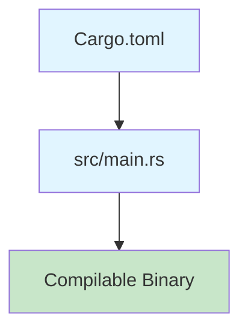

# Step 1: Initialize Rust Project Structure

**Refer to spec.md**

## Goal
Set up the basic Rust project structure for the Dragonball CLI tool.

## Tasks
1. Run `cargo init --name dragonball-cli` to create project
2. Create proper directory structure:
   - `src/api/` directory
   - `tests/` directory
3. Create `.gitignore` with required entries:
   - `semantic.db`
   - `mcp.log`
   - Standard Rust ignores (`target/`, `Cargo.lock` for binaries)
4. Initialize git repository if not already done
5. Verify project compiles with `cargo build`

## Expected Outcome
- Compiling Rust project with standard Hello World
- Clean directory structure
- Git repository initialized
- .gitignore in place

## Architecture Context


## Lines Changed
~20 lines (Cargo.toml, .gitignore, directory structure)

## Verification
```bash
cargo build
./target/debug/dragonball-cli
```
Should compile and run successfully (even if just Hello World).

## Proposed Solution

I will initialize the Rust project structure following these steps:

1. **Initialize Cargo Project**: Run `cargo init --name dragonball-cli` to create the basic Rust project structure with Cargo.toml and src/main.rs
2. **Create Directory Structure**:
   - Create `src/api/` directory for API-related code modules
   - Create `tests/` directory for integration tests
3. **Setup .gitignore**: Create a comprehensive .gitignore file that includes:
   - `semantic.db` (SAH search database)
   - `mcp.log` (SAH log file)
   - `target/` (Rust build artifacts)
   - `Cargo.lock` (for binary projects, this should be ignored)
4. **Verify Build**: Run `cargo build` to ensure the project compiles successfully
5. **Verify Execution**: Run the compiled binary to ensure it executes

The git repository is already initialized, so step 4 from the issue is already complete.

This will provide a clean foundation for the Dragonball CLI tool with proper Rust project conventions and SAH requirements.

## Implementation Notes

### Completed Steps:
1. **Cargo Initialization**: Successfully ran `cargo init --name dragonball-cli`
   - Created Cargo.toml with package metadata (name: dragonball-cli, version: 0.1.0, edition: 2021)
   - Created src/main.rs with default "Hello, world!" program
2. **Directory Structure**: Created required directories
   - `src/api/` directory for API modules
   - `tests/` directory for integration tests
3. **Gitignore Setup**: Created comprehensive .gitignore with:
   - SwissArmyHammer specific files (semantic.db, mcp.log)
   - Rust build artifacts (target/, Cargo.lock)
   - IDE and OS files for cleaner repository
4. **Build Verification**:
   - `cargo build` completed successfully in 0.25s
   - Binary execution confirmed: ./target/debug/dragonball-cli outputs "Hello, world!"

### Decisions Made:
- Included Cargo.lock in .gitignore as this is a binary project (standard Rust practice)
- Added common IDE and OS files to .gitignore for developer convenience
- Git repository was already initialized, so no action needed there

### Project Status:
- Basic Rust project structure is now in place
- Project compiles and runs successfully
- Ready for dependency additions and API implementation in subsequent issues
