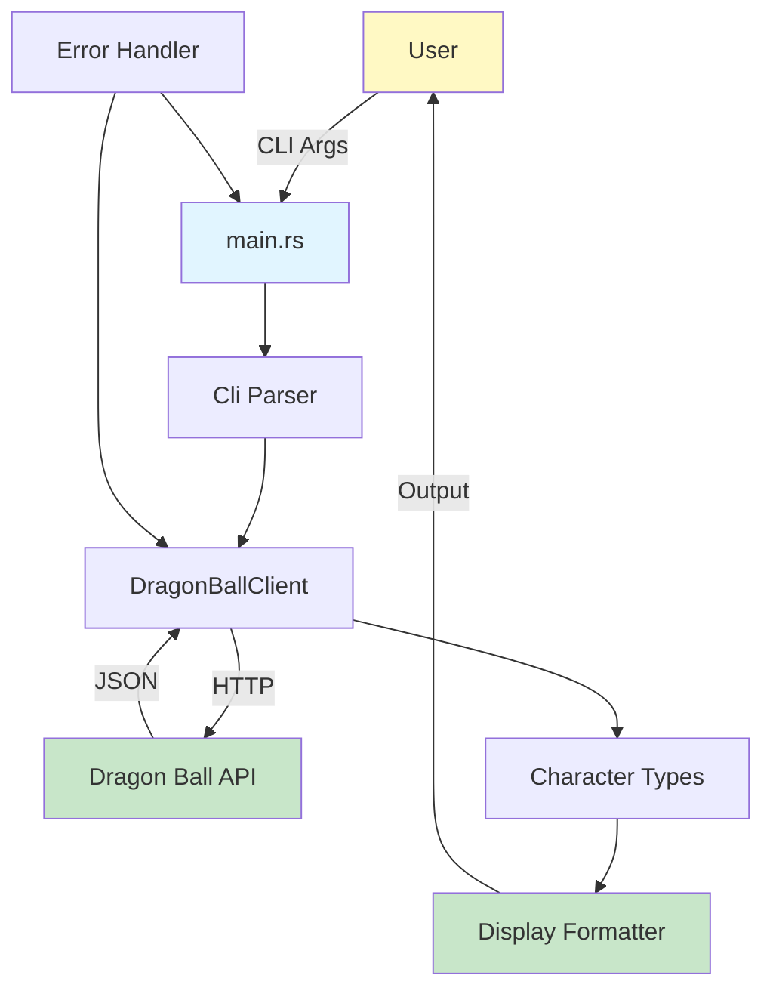

# Dragon Ball CLI - Implementation Plan Overview

**Refer to spec.md**

## Project Goal
Build a Rust CLI tool that accepts a Dragon Ball character name and fetches information from a Dragon Ball wiki API. Include tests and documentation.

## Implementation Approach
This plan breaks the implementation into 12 small, incremental steps. Each step:
- Builds on previous steps
- Results in compilable code
- Stays under 250 lines of changes
- Is independently testable
- Follows Rust coding standards

## Plan Steps

### Phase 1: Foundation (Steps 1-3)
1. **spec_000001_initialize_project.md** - Set up Cargo project structure, .gitignore
2. **spec_000002_add_dependencies.md** - Add clap, reqwest, serde, tokio dependencies
3. **spec_000003_research_api.md** - Research Dragon Ball API, document endpoints

### Phase 2: API Integration (Steps 4-6)
4. **spec_000004_define_api_types.md** - Create Character types with serde
5. **spec_000005_implement_http_client.md** - Build HTTP client wrapper
6. **spec_000006_add_error_handling.md** - Add custom error types

### Phase 3: CLI & Display (Steps 7-9)
7. **spec_000007_implement_cli_parsing.md** - Implement clap CLI argument parsing
8. **spec_000008_create_display_formatter.md** - Create output formatters
9. **spec_000009_connect_main_entry.md** - Wire everything together in main.rs

### Phase 4: Testing & Documentation (Steps 10-12)
10. **spec_000010_add_unit_tests.md** - Comprehensive unit tests
11. **spec_000011_add_integration_tests.md** - End-to-end integration tests
12. **spec_000012_complete_readme.md** - Complete README documentation

## Architecture

## Key Technologies
- **Language**: Rust
- **CLI**: clap v4
- **HTTP**: reqwest v0.12
- **JSON**: serde/serde_json
- **Async**: tokio
- **Testing**: cargo nextest

## Coding Standards Compliance
- Uses cargo nextest for testing (not cargo test)
- No mocks in tests (uses real API client)
- Follows TDD approach where applicable
- All files formatted with `cargo fmt`
- All lints checked with `cargo clippy`
- Types instead of primitives for domain concepts
- Comprehensive error handling
- .gitignore includes semantic.db and mcp.log

## Estimated Lines of Code
Total: ~900 lines across all steps
- Foundation: ~100 lines
- API Integration: ~200 lines
- CLI & Display: ~180 lines
- Testing: ~270 lines
- Documentation: ~150 lines

## Next Steps
Begin with step 1: Initialize project structure
