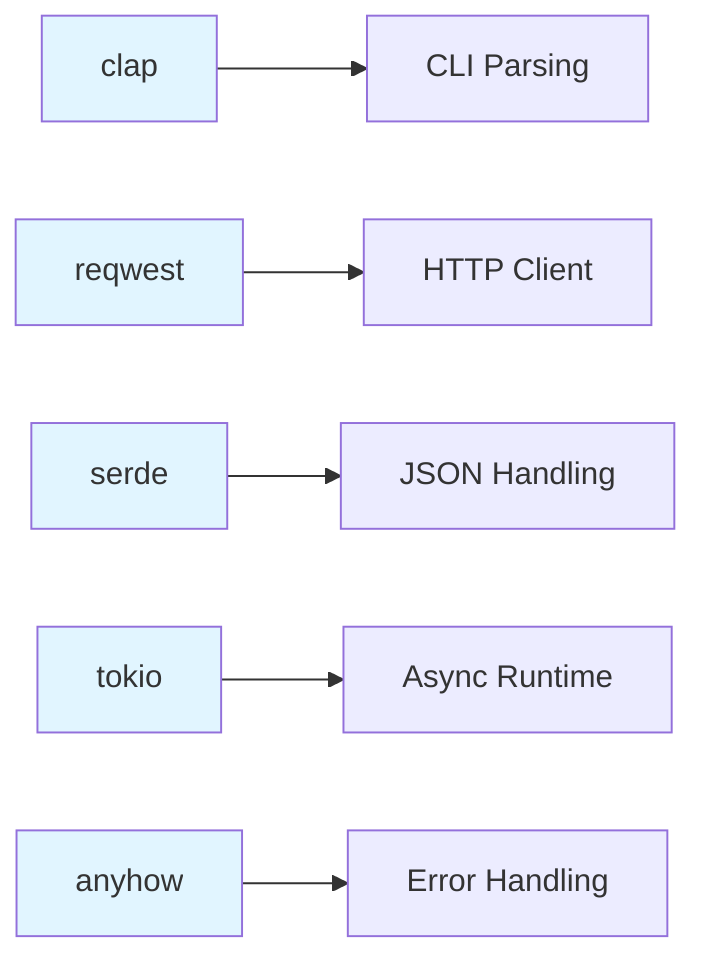

# Step 2: Add Core Dependencies

**Refer to spec.md**

## Goal
Add all required dependencies to Cargo.toml for CLI functionality, HTTP requests, and JSON parsing.

## Tasks
1. Add `clap` with derive feature for CLI argument parsing
2. Add `reqwest` with json feature for HTTP client
3. Add `serde` and `serde_json` for JSON serialization
4. Add `tokio` with full feature for async runtime
5. Add `anyhow` for error handling
6. Add dev-dependency `cargo-nextest` for testing (per coding standards)
7. Verify all dependencies resolve with `cargo build`

## Dependencies to Add
```toml
[dependencies]
clap = { version = "4.5", features = ["derive"] }
reqwest = { version = "0.12", features = ["json"] }
serde = { version = "1.0", features = ["derive"] }
serde_json = "1.0"
tokio = { version = "1.40", features = ["full"] }
anyhow = "1.0"
```

## Expected Outcome
- All dependencies in Cargo.toml
- Project still compiles
- Ready for implementation

## Architecture Context


## Lines Changed
~15 lines in Cargo.toml

## Verification
```bash
cargo build
```
Should compile successfully with all new dependencies.
