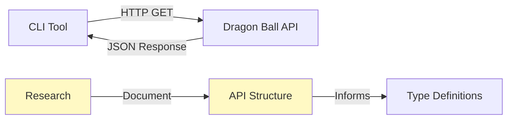

# Step 3: Research and Document Dragon Ball API

**Refer to spec.md**

## Goal
Identify and document the Dragon Ball API to use, test endpoints, and understand response structure.

## Tasks
1. Research public Dragon Ball APIs (e.g., dragonball-api.com, dragonballapi.com)
2. Test API endpoints manually using curl or browser
3. Document the API structure in a memo file
4. Identify character search/lookup endpoint
5. Capture sample JSON responses
6. Document rate limits, authentication requirements (if any)

## Recommended API
Investigate: https://web.dragonball-api.com/ or similar public APIs

## Expected Outcome
- Memo file created: `.swissarmyhammer/memos/dragonball_api.md`
- Sample JSON responses captured
- API endpoint URL documented
- Response structure understood

## Sample API Test
```bash
# Test command to run
curl "https://dragonball-api.com/api/characters?name=Goku"
```

## Architecture Context


## Lines Changed
~0 lines of code (research/documentation only)
~50 lines of documentation in memo

## Verification
- Memo file exists with API documentation
- Can successfully curl the API and get character data
