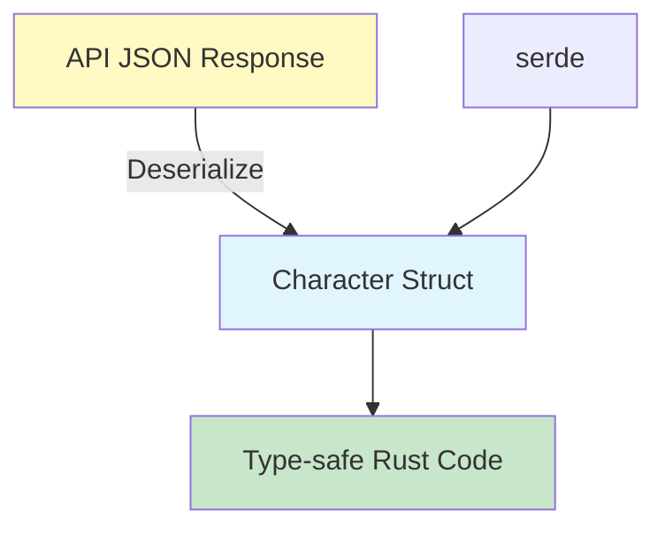

# Step 4: Define API Response Types

**Refer to spec.md**

## Goal
Create Rust types that match the Dragon Ball API JSON response structure.

## Tasks
1. Create `src/api/mod.rs` with module exports
2. Create `src/api/types.rs`
3. Define `Character` struct matching API response
4. Add appropriate serde derives (`Deserialize`, `Debug`, `Clone`)
5. Handle optional fields with `Option<T>`
6. Use proper Rust naming conventions (snake_case with serde rename)
7. Add rustdoc comments to types
8. Add basic unit tests for deserialization

## Example Structure
```rust
use serde::Deserialize;

/// Represents a Dragon Ball character from the API
#[derive(Debug, Clone, Deserialize)]
pub struct Character {
    pub id: u64,
    pub name: String,
    pub ki: Option<String>,
    pub race: Option<String>,
    // ... other fields based on API response
}
```

## Expected Outcome
- `src/api/types.rs` with Character type
- Module properly exported in `src/api/mod.rs`
- Compiles with no warnings
- Unit tests verify JSON deserialization

## Architecture Context


## Lines Changed
~60 lines (types.rs ~40, mod.rs ~5, tests ~15)

## Verification
```bash
cargo build
cargo nextest run
```
All tests should pass.
