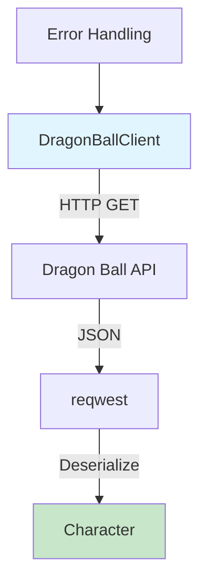

# Step 5: Implement HTTP Client for Dragon Ball API

**Refer to spec.md**

## Goal
Create an HTTP client wrapper that fetches character data from the Dragon Ball API.

## Tasks
1. Create `src/api/client.rs`
2. Define `DragonBallClient` struct with reqwest client
3. Implement `new()` constructor with base URL
4. Implement `get_character(&self, name: &str)` method
5. Handle HTTP errors appropriately
6. Add timeout configuration
7. Add rustdoc comments
8. Add unit tests using mock responses

## Example Structure
```rust
use reqwest::Client;
use anyhow::Result;
use super::types::Character;

/// Client for interacting with the Dragon Ball API
pub struct DragonBallClient {
    client: Client,
    base_url: String,
}

impl DragonBallClient {
    /// Creates a new Dragon Ball API client
    pub fn new() -> Self {
        // implementation
    }

    /// Fetches character information by name
    pub async fn get_character(&self, name: &str) -> Result<Character> {
        // implementation
    }
}
```

## Expected Outcome
- `src/api/client.rs` with DragonBallClient
- Async methods for fetching character data
- Proper error handling
- Compiles and tests pass

## Architecture Context


## Lines Changed
~80 lines (client.rs ~60, tests ~20)

## Verification
```bash
cargo build
cargo nextest run
```
All tests should pass.
