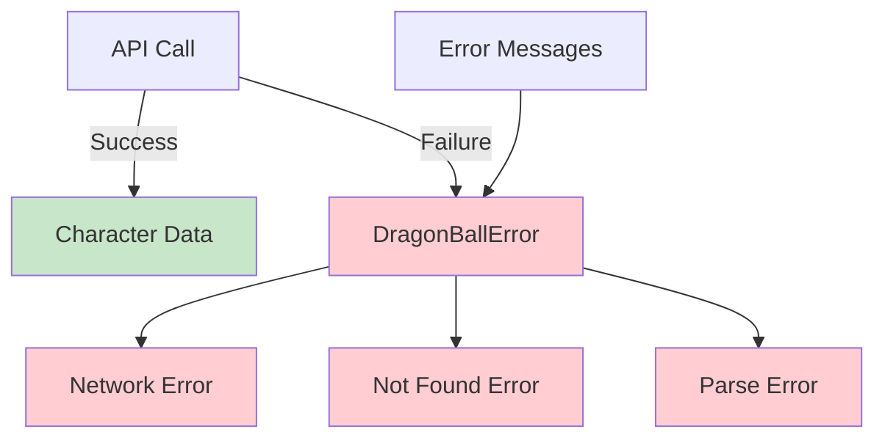

# Step 6: Implement Robust Error Handling

**Refer to spec.md**

## Goal
Create custom error types and proper error handling for the CLI tool.

## Tasks
1. Create `src/error.rs`
2. Define custom error enum covering:
   - API errors (network, HTTP status)
   - Character not found
   - JSON parsing errors
3. Implement Display and Error traits
4. Add error context with helpful messages
5. Use `anyhow::Result` where appropriate
6. Add error handling in client methods
7. Add tests for error scenarios

## Example Structure
```rust
use thiserror::Error;

#[derive(Debug, Error)]
pub enum DragonBallError {
    #[error("Character '{0}' not found")]
    CharacterNotFound(String),

    #[error("API request failed: {0}")]
    ApiError(#[from] reqwest::Error),

    #[error("Failed to parse API response: {0}")]
    ParseError(#[from] serde_json::Error),
}
```

## Expected Outcome
- `src/error.rs` with custom error types
- All API methods return proper Result types
- Clear error messages for users
- Error tests pass

## Architecture Context


## Lines Changed
~60 lines (error.rs ~40, updates to client.rs ~20)

## Note
May need to add `thiserror` dependency if not using anyhow for everything.

## Verification
```bash
cargo build
cargo nextest run
```
All tests should pass including error cases.
