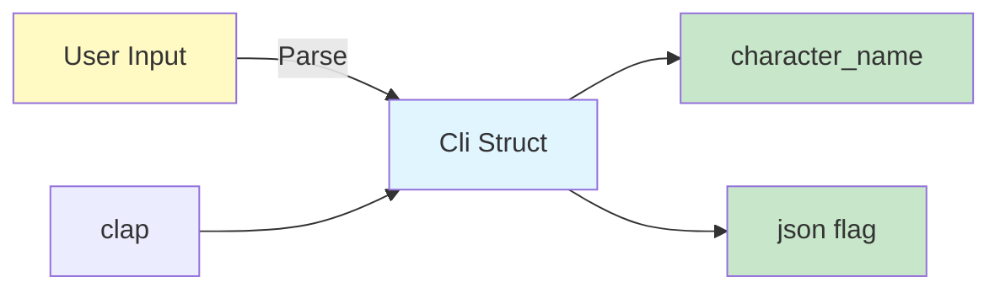

# Step 7: Implement CLI Argument Parsing

**Refer to spec.md**

## Goal
Create CLI interface using clap to accept character names as arguments.

## Tasks
1. Create `src/cli.rs`
2. Define `Cli` struct with clap derives
3. Add character name argument (required)
4. Add optional flags (e.g., --json for JSON output)
5. Add help text and examples
6. Add version information from Cargo.toml
7. Export from lib.rs
8. Add tests for CLI parsing

## Example Structure
```rust
use clap::Parser;

/// CLI tool to fetch Dragon Ball character information
#[derive(Parser, Debug)]
#[command(
    name = "dragonball-cli",
    version,
    about = "Fetch information about Dragon Ball characters",
    long_about = None
)]
pub struct Cli {
    /// Name of the Dragon Ball character to look up
    pub character_name: String,

    /// Output raw JSON response
    #[arg(short, long)]
    pub json: bool,
}
```

## Expected Outcome
- `src/cli.rs` with Cli struct
- Help text displays correctly
- Arguments parse correctly
- Tests verify parsing logic

## Architecture Context


## Lines Changed
~50 lines (cli.rs ~35, tests ~15)

## Verification
```bash
cargo build
./target/debug/dragonball-cli --help
```
Should display help text with character_name argument.
