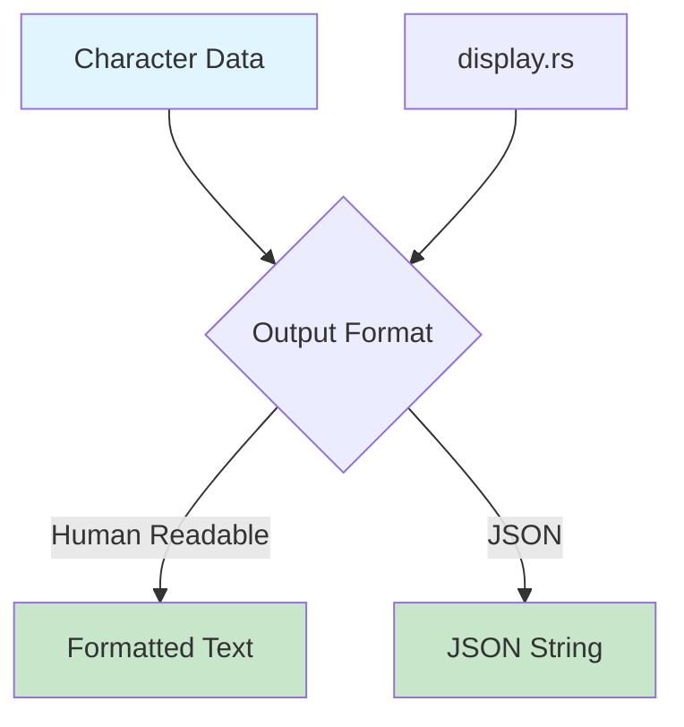

# Step 8: Create Display Formatter for Character Data

**Refer to spec.md**

## Goal
Implement formatted output for character information in human-readable format.

## Tasks
1. Create `src/display.rs`
2. Implement function to format Character data
3. Handle optional fields gracefully (show "Unknown" or skip)
4. Create clean, readable output format
5. Add JSON output option
6. Use proper formatting with indentation
7. Add rustdoc comments
8. Add tests for formatting

## Example Structure
```rust
use crate::api::types::Character;

/// Formats character information for display
pub fn format_character(character: &Character) -> String {
    // Create formatted string with character info
}

/// Outputs character as JSON
pub fn format_character_json(character: &Character) -> Result<String> {
    serde_json::to_string_pretty(character)
        .map_err(Into::into)
}
```

## Example Output
```
Name: Goku
Race: Saiyan
Ki: 60,000,000
Affiliation: Z Fighter
Description: The main protagonist of Dragon Ball...
```

## Expected Outcome
- `src/display.rs` with formatting functions
- Human-readable character output
- JSON output option
- Tests verify formatting

## Architecture Context


## Lines Changed
~70 lines (display.rs ~50, tests ~20)

## Verification
```bash
cargo nextest run
```
All formatting tests should pass.
