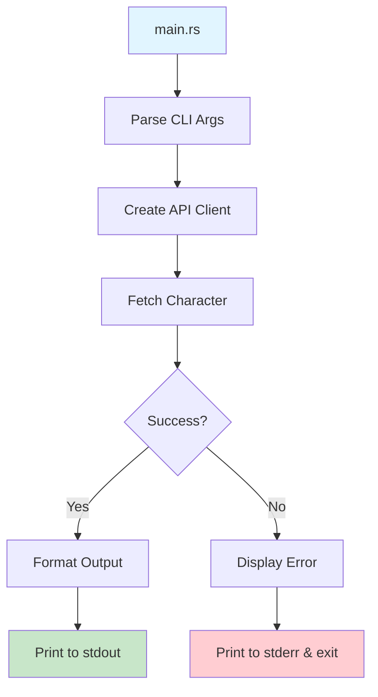

# Step 9: Connect CLI to API in Main Entry Point

**Refer to spec.md**

## Goal
Wire together all components in main.rs to create a functioning CLI tool.

## Tasks
1. Update `src/main.rs`
2. Parse CLI arguments using clap
3. Create DragonBallClient instance
4. Call API with character name
5. Format and display results
6. Handle errors with user-friendly messages
7. Set up tokio async runtime
8. Add proper tracing/logging with tracing crate
9. Test end-to-end functionality

## Example Structure
```rust
use clap::Parser;
use dragonball_cli::{cli::Cli, api::client::DragonBallClient, display};

#[tokio::main]
async fn main() -> anyhow::Result<()> {
    let cli = Cli::parse();

    let client = DragonBallClient::new();

    match client.get_character(&cli.character_name).await {
        Ok(character) => {
            if cli.json {
                println!("{}", display::format_character_json(&character)?);
            } else {
                println!("{}", display::format_character(&character));
            }
        }
        Err(e) => {
            eprintln!("Error: {}", e);
            std::process::exit(1);
        }
    }

    Ok(())
}
```

## Expected Outcome
- Functioning CLI binary
- CLI can fetch and display character data
- Errors handled gracefully
- User-friendly output

## Architecture Context


## Lines Changed
~60 lines (main.rs ~50, lib.rs updates ~10)

## Verification
```bash
cargo build
./target/debug/dragonball-cli Goku
```
Should fetch and display Goku's information.
