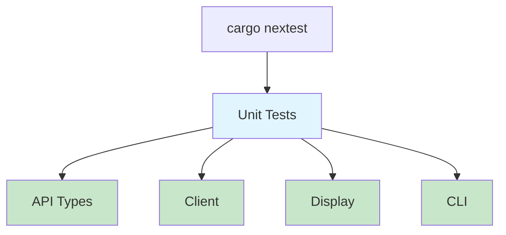

# Step 10: Add Comprehensive Unit Tests

**Refer to spec.md**

## Goal
Add unit tests for all modules to ensure code reliability.

## Tasks
1. Add tests to `src/api/types.rs` for JSON deserialization
2. Add tests to `src/api/client.rs` for client methods
3. Add tests to `src/display.rs` for formatting functions
4. Add tests to `src/cli.rs` for argument parsing
5. Add tests for error handling scenarios
6. Ensure all tests use real data structures (no mocks per coding standards)
7. Run tests with `cargo nextest run`
8. Fix any failing tests
9. Verify test output is pristine (no unexpected logs)

## Test Coverage Areas
- JSON deserialization of valid responses
- JSON deserialization of malformed data
- Display formatting with complete data
- Display formatting with missing/optional fields
- CLI parsing with valid arguments
- CLI parsing with invalid arguments
- Error type conversions

## Example Test Structure
```rust
#[cfg(test)]
mod tests {
    use super::*;

    #[test]
    fn test_deserialize_character() {
        let json = r#"{"id": 1, "name": "Goku", "race": "Saiyan"}"#;
        let character: Character = serde_json::from_str(json).unwrap();
        assert_eq!(character.name, "Goku");
    }
}
```

## Expected Outcome
- Comprehensive unit test coverage
- All tests passing
- Clean test output with no warnings
- Tests run in parallel with nextest

## Architecture Context


## Lines Changed
~150 lines (distributed across test modules)

## Verification
```bash
cargo nextest run --fail-fast
cargo clippy
```
All tests pass, no clippy warnings.
