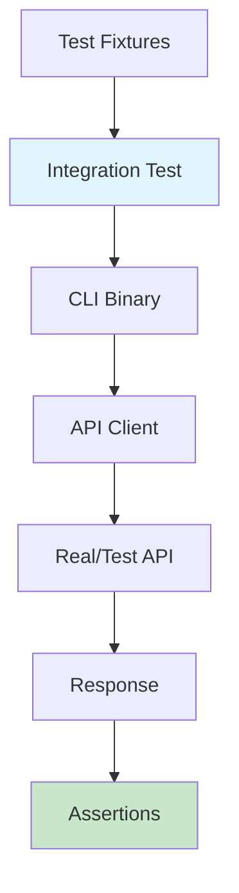

# Step 11: Add Integration Tests

**Refer to spec.md**

## Goal
Create integration tests that verify the entire CLI tool functionality end-to-end.

## Tasks
1. Create `tests/integration_test.rs`
2. Create `tests/fixtures/` directory for test data
3. Add sample API response JSON files as fixtures
4. Test successful character lookup flow
5. Test character not found scenario
6. Test network error handling
7. Test JSON output format
8. Test invalid input handling
9. Use real API client (no mocks per coding standards)
10. Run tests with `cargo nextest run`

## Test Scenarios
1. **Happy Path**: Character found and displayed
2. **Not Found**: Character doesn't exist
3. **API Error**: Network/HTTP errors
4. **JSON Output**: Verify --json flag works
5. **Invalid Name**: Empty or malformed input

## Example Test Structure
```rust
use assert_cmd::Command;
use predicates::prelude::*;

#[test]
fn test_character_lookup_success() {
    let mut cmd = Command::cargo_bin("dragonball-cli").unwrap();
    cmd.arg("Goku")
        .assert()
        .success()
        .stdout(predicate::str::contains("Goku"));
}

#[test]
fn test_character_not_found() {
    let mut cmd = Command::cargo_bin("dragonball-cli").unwrap();
    cmd.arg("NonexistentCharacter")
        .assert()
        .failure();
}
```

## Expected Outcome
- Integration tests in `tests/` directory
- Test fixtures for sample data
- All integration tests passing
- End-to-end functionality verified

## Additional Dependencies Needed
Add to `Cargo.toml` dev-dependencies:
```toml
[dev-dependencies]
assert_cmd = "2.0"
predicates = "3.1"
```

## Architecture Context


## Lines Changed
~120 lines (integration tests ~100, fixtures ~20)

## Verification
```bash
cargo nextest run --fail-fast
```
All integration tests pass.
