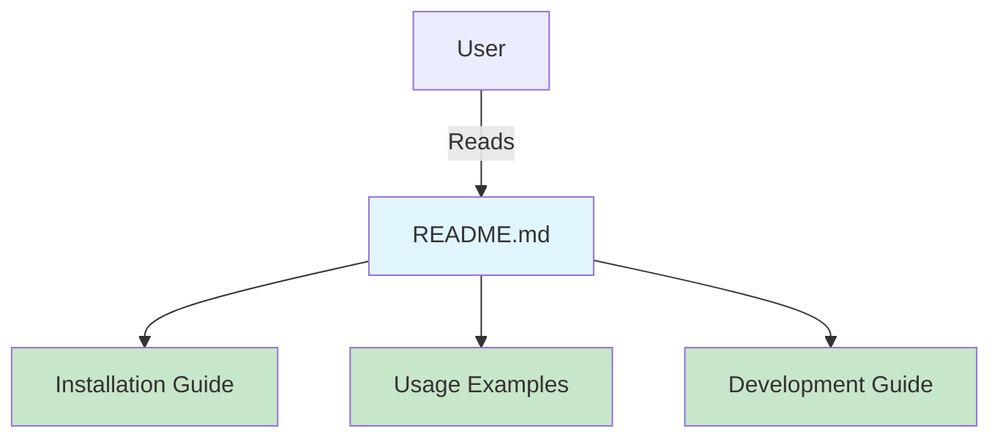

# Step 12: Complete README Documentation

**Refer to spec.md**

## Goal
Create comprehensive README documentation for the project.

## Tasks
1. Create `README.md` in project root
2. Add project description and purpose
3. Add installation instructions
4. Add usage examples with sample output
5. Add Dragon Ball API attribution
6. Add development setup instructions
7. Add testing instructions (using cargo nextest)
8. Add contributing guidelines
9. Add license information if applicable
10. Add examples for different use cases

## README Sections
1. **Title and Description**: What is dragonball-cli?
2. **Installation**: How to install/build
3. **Usage**: Command examples with output
4. **Options**: Document CLI flags and arguments
5. **Examples**: Multiple usage scenarios
6. **API Attribution**: Credit Dragon Ball API
7. **Development**: How to contribute and develop
8. **Testing**: How to run tests
9. **License**: License information

## Example Structure
```markdown
# Dragonball CLI

A command-line tool to fetch Dragon Ball character information.

## Installation

\`\`\`bash
cargo install --path .
\`\`\`

## Usage

\`\`\`bash
dragonball-cli Goku
\`\`\`

...
```

## Expected Outcome
- Complete README.md with all sections
- Clear installation and usage instructions
- Example commands with expected output
- Professional documentation

## Architecture Context


## Lines Changed
~150 lines (README.md)

## Verification
- README is clear and complete
- All command examples are accurate
- Documentation matches actual CLI behavior
- Test by having someone else try to use it based solely on README
